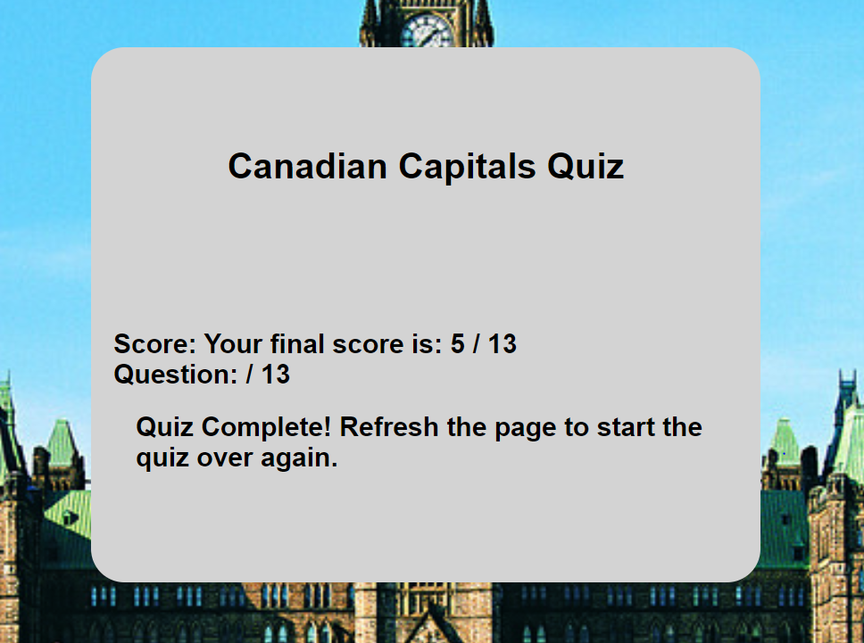
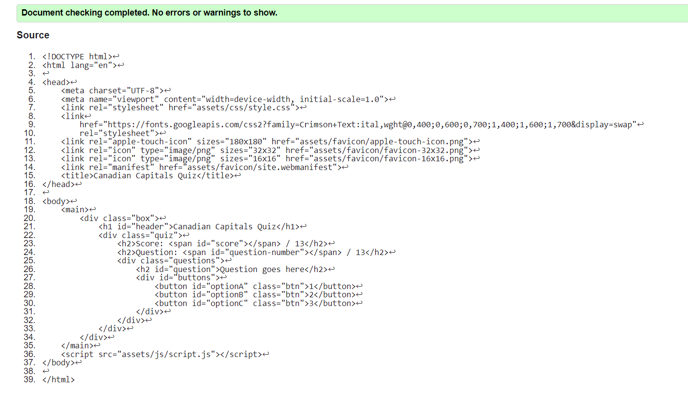
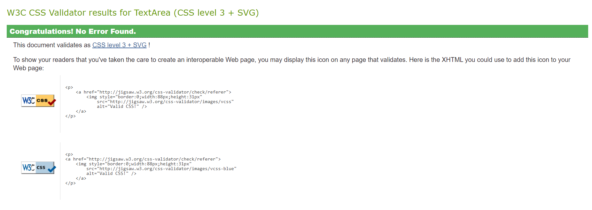
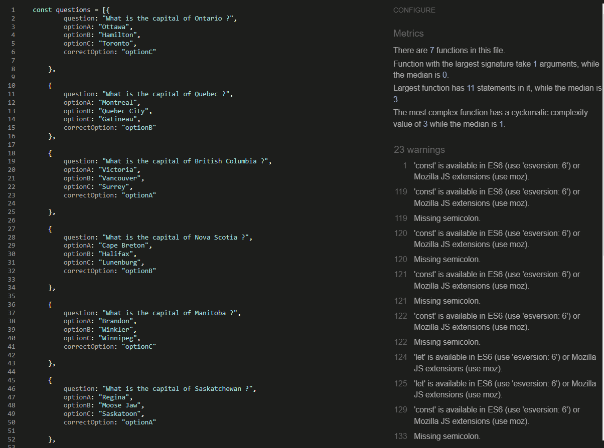
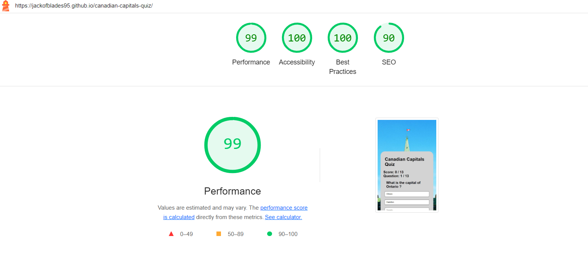

# [Canadian Captials Quiz] (https://jackofblades95.github.io/canadian-capitals-quiz/)

* Canadian Capitals Quiz is a simple website designed to challenge the user's knowledge of the capital cities of the Nation of Canada, with a small quiz.
* Canadian Capitals Quiz consists of one main page.
* Canadian Capitals Quiz has a fully functional quiz that consists of a multiple headers that state the name of the quiz, score tracker, question tracker, that actively updates as the user plays the quiz. Three buttons are used the give the player options to choose between answers.
* The site is targeted towards people who would like to test their knowledge of the various capital cities of Canada.

## Screenshots
Below is a screenshot of Canadian Captials Quiz created using the "Am I Responsive" website.

| Screenshot |

## User Stories

### First Time Site Users

* As a new site user, I would like to know what the site is about.
* As a new site user, I would like to play a functional quiz that tests my knowledge on Canadian capital cities.
* As a new site user, I would like the game to track my score and show me what question im currently on.
* As a new site user, I would like the quiz to tell me my final score when its finished and how to play again.
* As a new site user, I would like the site to be easy to navigate.

## Design

### Color Scheme

* Colors used:

* #000000 for : color, hover, text.
* #ffffff for : background of buttons.
* #d3d3d3 for : background of quiz containers.

### Typography

* I used the google font "Crimson-Text" for Canadian Captials Quiz.
* [Google Font Crimson Text](https://fonts.google.com/specimen/Crimson+Text)

## Features

* Canadians Captials Quiz has a fully function quiz that tracks your score and which question the user is currently on.
* The header at the top of the quiz container clearly states what the quiz is about and the background consists of an image of the Canadian parliament.
* When the player picks an option the score is either A: updated if the player is correct or B: The user's score stays unchanged if incorrect.
* When the player has gone through all thirteen questions, the questions will be hidden and the user will be give their final score along with a message saying "Quiz Complete!, Please refresh the page to play again" When the user refreshes the page the quiz is reset along with the users score and questions. See screen shot below:
* | Screenshot |
* 

### Features Left to Implement

* When there is time, I would like to update the styles to make the quiz more appealing and add a restart button to automatically restart the quiz when the user clicks on it.

## Tools & Technologies Used

* [HTML](https://en.wikipedia.org/wiki/HTML)
* [CSS](https://en.wikipedia.org/wiki/CSS)
* [JavaScript](https://en.wikipedia.org/wiki/JavaScript)
* [CSS Flex Box](https://www.w3schools.com/css/css3_flexbox.asp)
* [Google Fonts](https://fonts.google.com/)
* [Favicon](https://en.wikipedia.org/wiki/Favicon)
* [Github](https://github.com/)

## Testing

* Testing was conducted through HTML, CSS, JavaScript validators and Lighthouse.
* Below the links are screenshots.
* [W3C HTML](https://validator.w3.org/#validate_by_input)
* [W3C CSS](https://jigsaw.w3.org/css-validator/#validate_by_input)
* [JS HINT](https://jshint.com/)

### Testing Screenshots

| Index.html Test |

| Style.CSS Test |

| Script.JS Test |

| Lighthouse Test |

## Deployment

* Project was deployed as follows:

* Steps:

* Go to the Settings tab of your GitHub repo.

* On the left-hand sidebar, in the Code and automation section, select Pages.

* Make sure:

* Source is set to 'Deploy from Branch'.

* Main branch is selected.

* Folder is set to / (root).

* Under Branch, click Save.

* Go back to the Code tab. Wait a few minutes for the build to finish and refresh your repo.

* On the right-hand side, in the Environments section, click on 'github-pages'.

* Click View deployment to see the live site. The URL will look similar to YOUR-USERNAME.github.io/canadian-capitals-quiz.