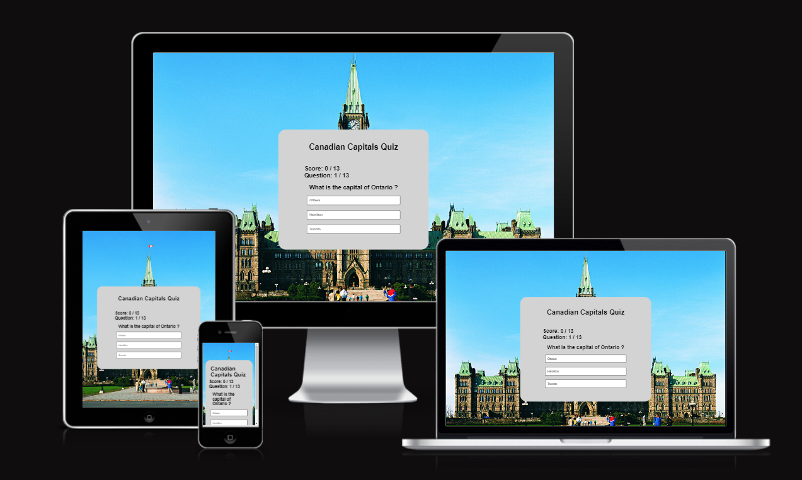

# [Canadian Captials Quiz] (https://jackofblades95.github.io/canadian-capitals-quiz/)

* Canadian Capitals Quiz is a simple website designed to challenge the user's knowledge of the capital cities of the Nation of Canada, with a small quiz.
* Canadian Capitals Quiz consists of one main page.
* Canadian Capitals Quiz has a fully functional quiz that consists of a multiple headers that state the name of the quiz, score tracker, question tracker, that actively updates as the user plays the quiz. Three buttons are used the give the player options to choose between answers.
* The site is targeted towards people who would like to test their knowledge of the various capital cities of Canada.

## Screenshots
Below is a screenshot of Canadian Captials Quiz created using the "Am I Responsive" website.

| Screenshot |

## User Stories

### First Time Site Users

* As a new site user, I would like to know what the site is about.
* As a new site user, I would like to play a functional quiz that tests my knowledge on Canadian capital cities.
* As a new site user, I would like the game to track my score and show me what question im currently on.
* As a new site user, I would like the quiz to tell me my final score when its finished and how to play again.
* As a new site user, I would like the site to be easy to navigate.

## Design

### Color Scheme

* Colors used:

* #000000 for : color, hover, text.
* #ffffff for : background of buttons.
* #d3d3d3 for : background of quiz containers.

### Typography
